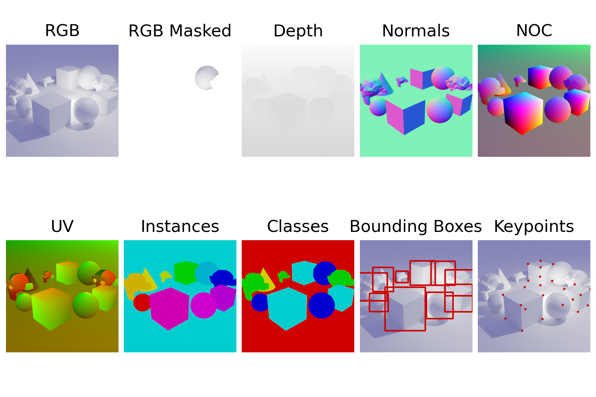
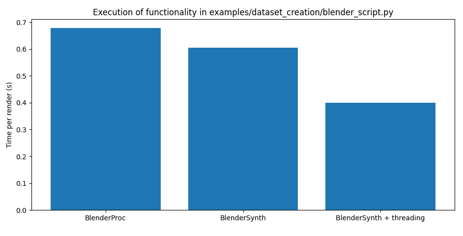

<a href="https://ollieboyne.github.io/BlenderSynth/">

</a>

<a href="https://ollieboyne.github.io/BlenderSynth/python/output_data.html">

</a>

<p align="center">
  <a href="https://opensource.org/licenses/MIT">
    
  </a>
    <a href="https://pypi.org/project/BlenderSynth/">
        
    </a>
    <a href="https://black.readthedocs.io">
            
    </a>    
  </p>

<p align="center"> 
<a href="https://ollieboyne.github.io/BlenderSynth/">Documentation</a> |
<a href="https://github.com/OllieBoyne/BlenderSynth">GitHub</a> |
<a href="https://pypi.org/project/blendersynth/">PyPI</a>
</p>

BlenderSynth is a Python library for generating large scale synthetic datasets using [Blender](https://www.blender.org/). Compared to other tools, BlenderSynth provides support for: <b>Custom <a href="https://docs.blender.org/manual/en/latest/render/shader_nodes/output/aov.html">Shader AOVs</a></b> to render rich per-pixel information; **node control**; <b><a href="https://ollieboyne.github.io/BlenderSynth/python/dataset_creation/index.html">multithreading</a></b> support; and <b><a href="https://ollieboyne.github.io/BlenderSynth/python/multiview_rendering.html">multiview</a></b> rendering support.

## Usage

See documentation for [installation](https://ollieboyne.github.io/BlenderSynth/getting_started/installation.html), [debugging/troubleshooting](https://ollieboyne.github.io/BlenderSynth/getting_started/troubleshooting.html) and [examples](https://ollieboyne.github.io/BlenderSynth/).

BlenderSynth supports Blender 3 and 4.

## Contributions and Projects

This project is currently in Beta. Please let me know what new features you would like, or feel free to make a pull request!

If you use BlenderSynth for a project, please [contact me](https://ollieboyne.github.io) about it - I might include it in the documentation as a usage example!

## Citing

If you use BlenderSynth in your work, please cite:

```
@software{blendersynth,
  author       = {Ollie Boyne},
  title        = {BlenderSynth},
  year         = 2023,
  publisher    = {GitHub},
  url          = {https://ollieboyne.github.io/BlenderSynth},
}
```

## Benchmarking

Rendering speed compared to [BlenderProc](https://github.com/DLR-RM/BlenderProc):


