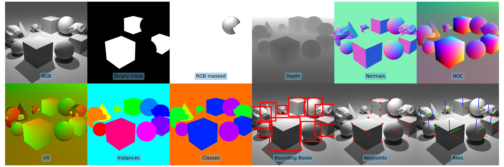

# BlenderSynth



[Documentation](https://ollieboyne.github.io/BlenderSynth/) | [GitHub](https://github.com/OllieBoyne/BlenderSynth)

Synthetic Blender pipeline - aimed at generating large synthetic datasets.

This library contains a collection of features for generating synthetic datasets. Compared to other tools, BlenderSynth is (a) more specialised for uncommon data formats, and (b) is designed for generating large scale datasets quickly and efficiently.

We produce support for:
- Custom Shader [AOVs](https://docs.blender.org/manual/en/latest/render/shader_nodes/output/aov.html) (eg. UVs, Normals, etc.)
- Fine-grained node control
- Multi-threading
- Efficient run-speed

## Examples

[See here](https://github.com/OllieBoyne/BlenderSynth/tree/main/examples) for usage examples.


## Contributions

This project is currently in Beta. Please let me know what new features you would like, or feel free to make a pull request!

## Citing

If you use BlenderSynth in your work, please cite us!

```
@software{blendersynth,
  author       = {Ollie Boyne},
  title        = {BlenderSynth},
  year         = 2023,
  publisher    = {GitHub},
  url          = {https://ollieboyne.github.io/BlenderSynth},
}
```

## Benchmarking

We compare our speed against [BlenderProc](https://github.com/DLR-RM/BlenderProc).


