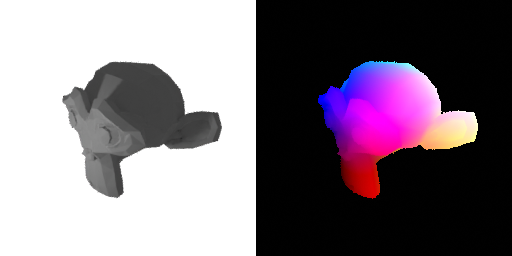

This script shows how to create a custom shader AOV - in this example, the XYZ position (normalized between -1 and 1) as RGB values.

If you create a custom AOV that you think might be useful to others, consider making a pull request to add it to the default set of AOVs!

Note: creating custom nodes requires a reasonable understanding of Blender's node trees. It is often easier to make the trees in Blender to test them, and then implement them in code.